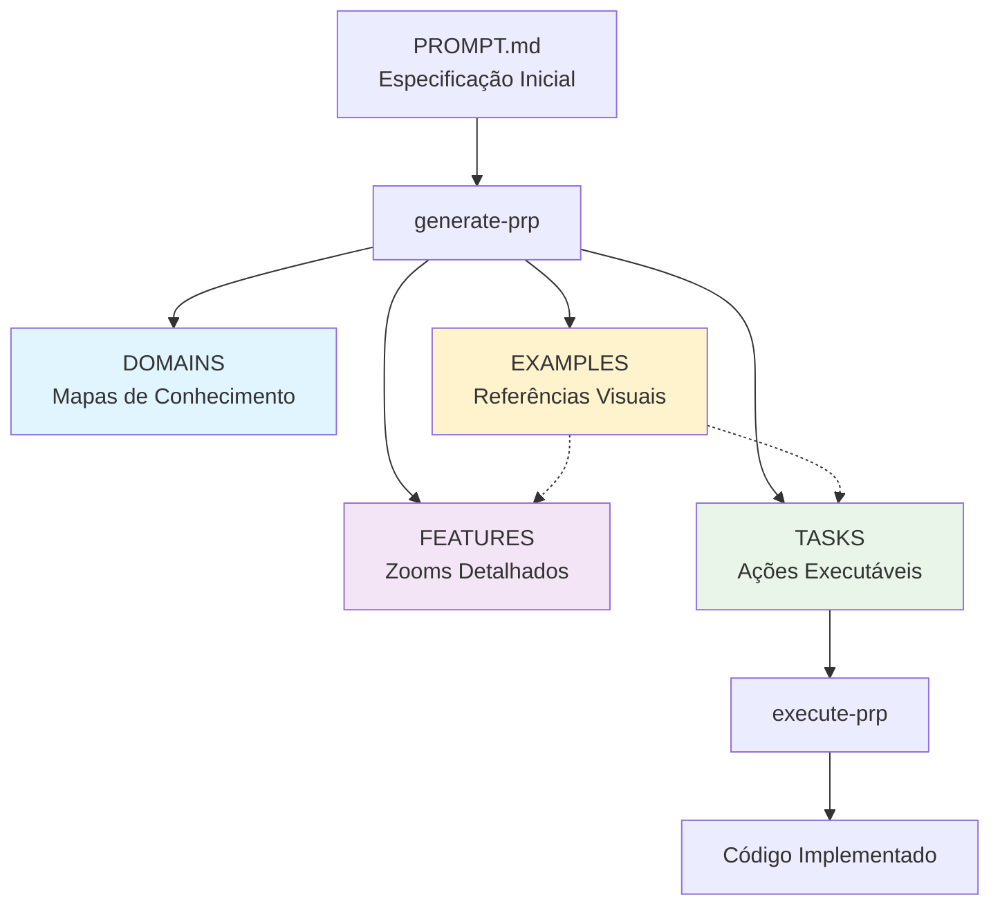

---
related:
  - prp-generation-blueprint.md
  - task-execution-blueprint.md
  - prp-execution-blueprint.md
  - domain-template.md
  - feature-template.md
  - task-template.md
---
# PRP-SYSTEM

PRP System - Product Requirements Prompts

## Overview

O PRP System é um framework de engenharia de contexto que transforma especificações gerais em documentação estruturada e tarefas executáveis por IA. O sistema resolve o problema fundamental: **se não especificarmos corretamente o contexto, a IA cria aplicações ruins que não atendem nossos objetivos**.

### Problema que Resolve

- **Contexto Insuficiente**: IAs implementam soluções incorretas quando não têm contexto adequado
- **Especificações Vagas**: Requisitos pouco detalhados geram código que não resolve problemas reais
- **Conhecimento Fragmentado**: Informações espalhadas impedem compreensão holística pela IA
- **Falta de Padrões**: Ausência de padrões consistentes gera implementações inconsistentes

### Solução Oferecida

O PRP System aplica **Context Engineering** para garantir que IAs recebam contexto estruturado, completo e otimizado para gerar código de qualidade que realmente resolve problemas.

## Arquitetura do Sistema

### Conceito Central: Mapa → Zoom → Tarefa



**Três Camadas de Abstração:**

| Camada | Propósito | Analogia |
|--------|-----------|----------|
| **DOMAINS** | Visão de alto nível, navegação, orientação | Mapa de uma cidade |
| **FEATURES** | Detalhamento profundo de cada área | Zoom em um bairro específico |
| **TASKS** | Ações executáveis com critérios de sucesso | Rota específica até o destino |

### Framework DTF (Domains-Tasks-Features)

**Domains**: Unidades atômicas de conhecimento reutilizável
- Padrões arquiteturais e conceituais
- Conhecimento especializado por área
- Context patterns para implementação
- Relacionamentos semânticos entre conceitos
- Aplicam decomposition strategy quando complexidade detectada
- **Podem servir como source of truth para data models** (ex: Data Architecture.md)

**Features**: Especificações completas de incrementos verticais
- Requisitos detalhados com critérios de aceitação
- Fluxos de usuário e snapshots de modelos de dados
- Especificações de API e arquitetura técnica
- Cenários de sucesso e tratamento de erros
- **Referenciam domains para definições autoritativas de dados**

**Tasks**: Context Engineering executável autocontido
- Contexto completo embebido para execução independente
- Passos específicos de implementação
- Padrões de qualidade e validação
- Critérios de aceitação testáveis
- Suporte para sub-tasks quando complexidade exige

## Comandos Principais

### generate-prp
**Propósito**: Transforma especificação em documentação estruturada

```bash
generate-prp [especificacao.md]
# Se não especificado, usa PROMPT.md como padrão
```

**Processo de 9 Passos**:
1. **Input Processing**: Valida requisitos e escaneia sistema
2. **System Loading**: Carrega estado completo atual
   - Inclui escaneamento de Examples/ para padrões visuais e referências
3. **Integration Analysis**: Planeja integração com matrix Extends/Conflicts/Net New
4. **Domain Upgrade**: Atualiza mapas de conhecimento com decomposition se necessário
   - Cria/atualiza Data Architecture domain quando modelos de dados são identificados
5. **Feature Evolution**: Cria/atualiza especificações detalhadas
6. **Context Engineering**: Compila conhecimento completo embebido
   - Inclui snapshots de data models para features
   - Referencia domains autoritativos para definições completas
7. **Task Generation**: Gera tasks autocontidas executáveis
8. **Relationship Update**: Atualiza links bidirecionais
9. **Quality Validation**: Verifica integridade do sistema

**Quality Gates**:
- **Requirements Clarity**: Entende o que construir ou PARA
- **System Consistency**: Mudanças não quebram padrões ou PARA
- **Task Completeness**: Task pode executar independente ou PARA
- **Integration Integrity**: Novo trabalho integra bem ou PARA

**Saída Produzida**:
- Domains atualizados ou criados com padrões
- Features detalhadas com especificações completas
- Tasks executáveis com Context Engineering completo
- Relacionamentos bidirecionais atualizados

### execute-prp
**Propósito**: Executa implementação com contexto apropriado

```bash
execute-prp task-01              # Executa task específica
execute-prp PROMPT.md           # Executa arquivo diretamente
execute-prp                     # Busca próxima task (in-progress ou todo)
```

**Comportamento Diferenciado**:
- **Tasks** (`Task {NN} - {Description}.md`): Aplica prp-execution-blueprint + task-execution-blueprint
- **Outros PRPs** (PROMPT.md, etc): Aplica apenas prp-execution-blueprint
- **Sem argumento**: Busca próxima task com status in-progress, depois todo

**Processo Base (prp-execution-blueprint)**:
1. **Pre-execution Validation**: Verifica ambiente (com opção de override)
2. **Context Understanding**: Compreende requisitos completos
3. **Implementation**: Escreve código seguindo padrões
4. **Testing & Validation**: Executa testes e valida solução
5. **Failure Handling**: Lida com problemas decisivamente
6. **Documentation & Cleanup**: Documenta e limpa ambiente

**Adições para Tasks (task-execution-blueprint)**:
- **Status Management**: Gerencia ciclo de vida (todo → in-progress → done)
- **Sub-task Execution**: Executa sub-tasks incrementalmente com TodoWrite
- **Task Metadata**: Mantém timestamps e informações de execução
- **Severity Handling**: Ajusta abordagem baseada em criticidade

**Failsafes e Overrides**:
- Sistema prioriza segurança mas permite flexibilidade
- Validações críticas perguntam antes de parar
- Usuário pode assumir riscos com confirmação explícita
- Exemplo: commits pendentes bloqueiam por padrão, mas permitem override

**Características Importantes**:
- **Execução Independente**: Não precisa ler documentação do system
- **Context Engineering**: Task contém todo conhecimento necessário
- **Auto-validação**: IA testa seu próprio trabalho
- **Sub-tasks**: Suporta execução incremental quando apropriado

## Estrutura de Arquivos

```
/
├── README.md                       # Documentação do repositório
├── .claude
│   └── commands
│       └── PRPs
│           ├── generate-prp.md     # Comando de geração
│           └── execute-prp.md      # Comando de execução
└── PRPs/
    ├── PRP-OVERVIEW.md                 # Documentação do projeto específico
    ├── PROMPT.md                   # Especificações do projeto
    │
    ├── System/                     # Framework e templates
    │   ├── PRP-SYSTEM.md           # Esta documentação
    │   ├── prp-generation-blueprint.md
    │   ├── prp-execution-blueprint.md
    │   ├── task-execution-blueprint.md
    │   ├── domain-template.md
    │   ├── feature-template.md
    │   └── task-template.md
    │
    ├── Examples/                   # Exemplos e referências visuais
    │   ├── UI/                     # Mockups e designs de interface
    │   │   ├── login-mockup.png
    │   │   └── dashboard-layout.png
    │   └── {Outros}/               # Outros exemplos do sistema    
    │
    ├── Domains/                    # Mapas de conhecimento
    │   ├── Authentication Backend.md
    │   ├── Frontend Architecture.md
    │   ├── Quality Assurance.md
    │   └── Data Architecture.md    # Source of truth para modelos
    │
    ├── Features/                   # Zooms detalhados
    │   ├── User Login System.md
    │   ├── Payment Integration.md
    │   └── Data Export Feature.md
    │
    └── Tasks/                      # Ações executáveis
        ├── Task 01 - Implement JWT Auth.md
        ├── Task 02 - Create User Dashboard.md
        └── Task 03 - Setup Payment Gateway.md
```

**Arquivos Principais**:
- `README.md`: Documentação geral do repositório
- `PRP-OVERVIEW.md`: Visão geral do projeto específico e navegação
- `PROMPT.md`: Especificações e requisitos do projeto
- `PRP-SYSTEM.md`: Documentação completa do framework (este arquivo)

## Convenções e Padrões

### Nomenclatura de Arquivos

**Domains**: `{Nome do Conhecimento}.md`
```
Authentication Backend.md
State Management Patterns.md
Database Design Principles.md
Data Architecture.md
```

**Features**: `{Descrição da Funcionalidade}.md`
```
User Registration System.md
Payment Processing Feature.md
Real Time Notifications.md
```

**Tasks**: `Task {NN} - {Verbo} {Descrição}.md`
```
Task 01 - Implement JWT Middleware.md
Task 02 - Create User Dashboard.md
Task 03 - Setup Database Migration.md
```

### Status e Severidade

**Status de Tasks** (no frontmatter):
- `todo`: Pronta para execução
- `in-progress`: Em desenvolvimento
- `review`: Aguardando revisão
- `done`: Concluída
- `blocked`: Bloqueada por dependências

**Severidade de Tasks**:
- `critical`: Emergência, quebra sistema
- `major`: Importante, impacto significativo
- `medium`: Trabalho padrão, impacto moderado
- `minor`: Baixa prioridade, melhorias

### Sub-tasks

Tasks podem conter sub-tasks para gerenciar complexidade:

```yaml
sub_tasks:
  - name: "Setup authentication middleware"
    status: todo
  - name: "Create login endpoint"
    status: todo
  - name: "Add token validation"
    status: todo
```

Execute-prp gerencia sub-tasks automaticamente quando presentes, usando TodoWrite para acompanhamento.

### Relacionamentos entre Documentos

**Frontmatter Links**:
```yaml
type: domain|feature|task
up: "Documento Pai.md"              # Hierarquia
related: "Documento Relacionado.md"  # Conexões laterais
dependencies: "Prerequisito.md"      # Dependências
feature: "Feature Pai.md"           # Tasks → Features
```

**Relacionamentos Bidirecionais**: Sistema mantém links em ambas direções automaticamente.

### Data Models e Context Engineering

**Snapshot para Context Engineering**:
Features incluem snapshots essenciais de data models para fornecer contexto de execução sem duplicar definições completas. O conceito permite:

- **Source of Truth Centralizado**: Modelos completos mantidos em Domain (ex: Data Architecture.md)
- **Context Lightweight**: Features carregam apenas campos essenciais para implementação
- **Evolução Segura**: Mudanças no modelo central não quebram features existentes
- **Referência Clara**: Sempre aponta para domain autoritativo

Exemplo em feature:
```yaml
# Snapshot para Context Engineering
# Definição completa em [[Data Architecture.md]]
User:
  essential_fields:
    - id: uuid
    - email: string
    - status: enum
```

### Examples e Referências Visuais

**Estrutura de Examples**:
A pasta Examples/ contém materiais de referência que guiam a implementação:

- **UI/**: Mockups de interface e referências de design (formato PNG preferencial)
  - Esboços do Figma ou screenshots de referência
  - Wireframes e layouts de componentes
  - Padrões visuais para consistência
- **{Outros}/**: Qualquer outro material de referência do sistema
  - Diagramas de arquitetura
  - Fluxos de processo
  - Exemplos de código

**Uso durante Geração**:
- generate-prp escaneia Examples/ durante fase de planejamento
- Features referenciam mockups UI para especificações visuais
- Tasks incluem links para exemplos relevantes no Context Engineering

**Formato Ideal para UI**:
- PNG para mockups e esboços (melhor compreensão pelo Claude)
- Imagens claras com bom contraste
- Preferir mockups do Figma sobre wireframes básicos para maior precisão

## Estratégias de Integration Analysis

### Matrix de Integração

Ao integrar novos requisitos, o sistema analisa:

| Tipo | Ação | Exemplo |
|------|------|---------|
| **Extends** | Atualiza domain/feature existente | Adicionar campo em autenticação |
| **Conflicts** | Resolve incompatibilidade | Mudar de REST para GraphQL |
| **Net New** | Cria nova documentação | Adicionar sistema de chat |

### Decomposition Strategy

Quando domains ficam complexos (>5 conceitos principais):
1. Identifica agrupamentos lógicos
2. Cria sub-domains focados
3. Mantém domain principal como índice
4. Atualiza relacionamentos

## Otimizações de Context Engineering

### Sequenciamento de Informação
- **Dependency-First**: Pré-requisitos antes de conceitos dependentes
- **General-to-Specific**: Visão geral antes de detalhes específicos
- **Problem-Solution**: Desafios seguidos imediatamente de soluções
- **Building Blocks**: Conceitos atômicos antes de combinações complexas

### Gestão de Carga Cognitiva
- **Chunk Optimization**: Informação em unidades de processamento otimais
- **Context Window Efficiency**: Máxima densidade de informação relevante
- **Attention Focus**: Informação crítica destacada apropriadamente
- **Noise Reduction**: Eliminação de informação irrelevante

### Relacionamentos Semânticos
- **Hierarchical**: Inheritance, composition, specialization, aggregation
- **Lateral**: Similarity, complementarity, alternatives, sequence
- **Bidirectional**: Relacionamentos mantidos automaticamente em ambas direções
- **Weighted**: Força de relacionamento para priorização de contexto

## Validações e Quality Gates

### Durante Geração (generate-prp)

**Pre-execution Checkpoints**:
1. Requisitos têm detalhes suficientes?
2. Sistema atual foi completamente carregado?
3. Conflitos de integração foram resolvidos?
4. Context Engineering está completo?

**Post-execution Validation**:
1. Tasks podem executar independentemente?
2. Relacionamentos estão consistentes?
3. Documentação cobre todos requisitos?
4. Padrões de qualidade mantidos?

### Durante Execução (execute-prp)

**Pre-execution Validation**:
1. Repositório está limpo ou usuário autorizou prosseguir?
2. Task tem status correto (se for task)?
3. Dependências estão resolvidas?
4. Context Engineering está presente?

**Runtime Checkpoints**:
1. Código compila/roda?
2. Testes passam?
3. Solução resolve o problema?
4. Qualidade atende padrões?

## Fluxo de Trabalho Completo

### 1. Especificação Initial
```markdown
# Em PROMPT.md
Criar sistema de autenticação com JWT para aplicação React.
Deve incluir login, registro, recuperação de senha.
Integrar com backend Node.js existente.
```

### 2. Geração de Estrutura
```bash
generate-prp
```

**Processo Interno**:
1. Analisa requisitos de autenticação
2. Carrega domains existentes de backend
3. Identifica integração tipo "Extends" com sistema atual
4. Atualiza domain "Authentication Backend" com padrões JWT
5. Cria/atualiza "Data Architecture" com modelos de User
6. Cria feature "User Authentication System" com snapshot de models
7. Gera Context Engineering para cada task
8. Cria 3 tasks com contexto embebido
9. Atualiza todos relacionamentos
10. Valida sistema completo

**Resultado**:
- **Domain atualizado**: `Authentication Backend.md` (+padrões JWT)
- **Domain criado/atualizado**: `Data Architecture.md` (modelos User)
- **Feature criada**: `User Authentication System.md` (specs + snapshot)
- **Tasks geradas**: 
  - `Task 01 - Implement JWT Middleware.md`
  - `Task 02 - Create Login Components.md`
  - `Task 03 - Setup Password Recovery.md`

### 3. Execução de Implementação
```bash
execute-prp task-01
```

**Processo Interno**:
1. Carrega prp-execution-blueprint + task-execution-blueprint
2. Valida ambiente e pede confirmação se necessário
3. Atualiza status para in-progress
4. Carrega Context Engineering embebido
5. Cria TODOs com TodoWrite se houver sub-tasks
6. Implementa código seguindo padrões
7. Roda testes automaticamente
8. Valida contra critérios de aceitação
9. Atualiza documentação
10. Marca como done
11. Limpa ambiente

**Resultado**:
- Código JWT implementado e testado
- Documentação atualizada
- Status: done
- Próxima task pronta para execução

### 4. Iteração e Expansão
- Adiciona novos requisitos em PROMPT.md
- `generate-prp` integra com sistema existente
- Novas tasks aproveitam Context Engineering acumulado
- Sistema evolui mantendo consistência

## Vantagens do Sistema

### Para Desenvolvedores
- **Contexto Consistente**: IA sempre tem informação necessária
- **Padrões Garantidos**: Qualidade mantida automaticamente
- **Implementação Eficiente**: Tasks autocontidas reduzem overhead
- **Evolução Controlada**: Sistema cresce de forma estruturada
- **Gestão de Complexidade**: Sub-tasks e decomposition para projetos grandes

### Para Projetos
- **Qualidade Previsível**: Código gerado segue padrões estabelecidos
- **Documentação Viva**: Conhecimento capturado e reutilizável
- **Escalabilidade**: Sistema cresce mantendo consistência
- **Auditabilidade**: Decisões arquiteturais documentadas
- **Integração Suave**: Matrix de análise previne conflitos

### Para IAs
- **Context Engineering**: Informação estruturada para máxima compreensão
- **Pattern Recognition**: Estruturas consistentes facilitam processamento
- **Autonomous Execution**: Tasks autocontidas permitem execução independente
- **Quality Validation**: Critérios embebidos permitem auto-validação
- **Failure Recovery**: Estratégias claras para lidar com problemas

## Casos de Uso

### Desenvolvimento de Features
```
PROMPT.md: "Adicionar sistema de comentários ao blog"
↓ generate-prp (9 passos)
Domains: Content Management, User Interactions, Data Architecture
Features: Blog Comments System (com snapshot de Comment model)
Tasks: Implement Comment API, Create Comment UI, Add Moderation
↓ execute-prp
Implementação completa com testes e validação
```

### Refatoração de Código
```
PROMPT.md: "Migrar autenticação de sessions para JWT"
↓ generate-prp (analisa tipo "Conflicts")
Domains: Authentication Backend (atualizado)
Features: JWT Migration Strategy
Tasks: Replace Session Middleware, Update Frontend Auth, Migrate User Data
↓ execute-prp (com sub-tasks)
Migração incremental segura
```

### Setup de Projeto
```
PROMPT.md: "Criar API REST para e-commerce com Node.js e PostgreSQL"
↓ generate-prp (tipo "Net New")
Domains: E-commerce Backend, API Design, Database Architecture, Data Architecture
Features: Product Catalog, Order Management, User Accounts
Tasks: Setup Project Structure, Implement Product API, Create Database Schema
↓ execute-prp
Projeto completo com arquitetura sólida
```

## Princípios Fundamentais

### Context Engineering First
> "Se a IA não tem contexto adequado, não pode gerar código adequado"

Todo o sistema é otimizado para fornecer contexto estruturado, completo e processável por IA.

### Quality by Design
> "Qualidade não é adicionada depois, é embebida desde o início"

Padrões de qualidade são embebidos no Context Engineering das tasks.

### Atomic Documentation
> "Cada unidade de conhecimento tem responsabilidade única e clara"

Domains, features e tasks mantêm responsabilidades focadas e bem definidas.

### Autonomous Execution
> "Tasks devem ser executáveis independentemente por qualquer IA competente"

Context Engineering embebido elimina dependências externas durante execução.

### Fail-Safe Operations
> "Melhor parar e pedir ajuda do que implementar errado"

Quality gates e failure handling previnem implementações incorretas, mas permitem override consciente quando necessário. O sistema balanceia segurança com praticidade através de confirmações explícitas.

## Evolução e Manutenção

O PRP System é auto-evolutivo:
- **Domains** acumulam conhecimento ao longo do tempo
- **Features** refinam especificações baseadas em implementações
- **Tasks** melhoram Context Engineering baseado em sucessos/falhas
- **Relacionamentos** se fortalecem com uso repetido
- **Patterns** emergem e são capturados automaticamente

O sistema melhora continuamente através do uso, criando contexto cada vez mais rico e efetivo para implementações futuras.

---

**Objetivo Final**: Garantir que qualquer IA competente possa implementar soluções de qualidade que resolvem problemas reais, usando Context Engineering estruturado e padrões embebidos pelo PRP System.