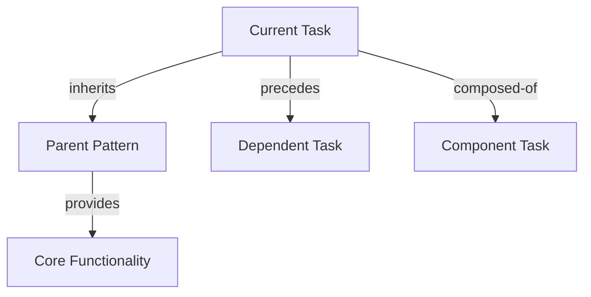

# Task NN - Action Description

```yaml
---
type: task
tags: [domain, technology, scope]
created: 2025-01-20
updated: 2025-01-20
status: 🔵 todo|🟡 in-progress|🟣 review|🟢 done|🔴 blocked
severity: 🔴 critical|🟠 major|🟡 medium|🟢 minor

# Hierarchical Relationships
up: "[[Primary Domain.md]]"
feature: "[[Parent Feature.md]]"

# Semantic Relationships with Weights
dependencies:
  - link: "[[Critical Dependency.md]]"
    type: "inherits|composed-of|precedes"
    weight: 1.0  # critical dependency
    description: "Relationship explanation"
  
  - link: "[[Supporting Context.md]]"
    type: "complements|similar-to"
    weight: 0.7  # supporting context
    description: "How this enhances the task"

related:
  - link: "[[Related Task.md]]"
    type: "alternative-to|similar-to|follows"
    weight: 0.4  # optional reference
    description: "Relationship context"

# Progress Monitoring
milestones:
  - id: "design-complete"
    description: "Design and planning finalized"
    status: pending
    completion_date: null
  
  - id: "implementation-50"
    description: "Core implementation 50% complete"
    status: pending
    completion_date: null
  
  - id: "validation-ready"
    description: "Ready for validation testing"
    status: pending
    completion_date: null

# Validation Integration
validation:
  checkpoints:
    - stage: "pre-implementation"
      criteria: ["dependencies resolved", "design reviewed"]
      status: pending
    
    - stage: "implementation"
      criteria: ["unit tests passing", "integration verified"]
      status: pending
    
    - stage: "completion"
      criteria: ["acceptance criteria met", "documentation updated"]
      status: pending
  
  quality_gates:
    - metric: "test_coverage"
      threshold: "80%"
      current: null
    
    - metric: "code_review"
      threshold: "approved"
      current: "pending"

# Implementation Tracking
implementation:
  estimated_effort: "S|M|L|XL"  # T-shirt sizing
  actual_effort: null
  blockers: []
  risks: []
---
```

## Context

[Explain why this task exists and what specific goal it accomplishes. Include the problem this task solves and its importance to the overall feature. Reference semantic relationships for deeper context understanding.]

## Relationships

### Implements Feature

[Reference the specific feature this task helps implement with semantic context:]

- **[[Feature Name.md]]**: [Brief description of how this task contributes to the feature]
  - Relationship Type: `composes|specializes|implements`
  - Integration Points: [Specific integration requirements]

### Dependency Chain

[Map critical dependencies using semantic relationship types:]



### Impact Analysis

[List domains and components affected by this task:]

- **[[Domain A.md]]**: 
  - Impact Type: `extends|modifies|integrates`
  - Specific Changes: [What will be impacted]
  - Risk Level: `low|medium|high`

- **[[Domain B.md]]**: 
  - Impact Type: `uses|enhances|replaces`
  - Specific Patterns: [Patterns used/modified]
  - Risk Level: `low|medium|high`

## Implementation

### Required Actions

[List specific actions with clear deliverables and validation points:]

1. **[Action 1]**: [Specific deliverable]
   - Validation: [How to verify completion]
   - Dependencies: [What must be done first]
   - Milestone: `design-complete`

2. **[Action 2]**: [Specific deliverable]
   - Validation: [How to verify completion]
   - Dependencies: [Prerequisites from action 1]
   - Milestone: `implementation-50`

3. **[Action 3]**: [Specific deliverable]
   - Validation: [How to verify completion]
   - Dependencies: [Prerequisites from action 2]
   - Milestone: `validation-ready`

### Files to Modify/Create

[Specify exact files with semantic context:]

- **Create**: [filepath/filename.ext]
  - Purpose: [Why this file is needed]
  - Relationships: [How it connects to existing system]
  - Validation: [How to verify correctness]

- **Modify**: [filepath/filename.ext]
  - Changes: [Specific modifications needed]
  - Impact: [What these changes affect]
  - Validation: [How to test changes]

### Implementation Patterns

[Reference reusable patterns from linked domains:]

```yaml
patterns_to_apply:
  - pattern: "[[Pattern Name.md]]"
    usage: "How to apply this pattern"
    customization: "Task-specific adaptations"
  
  - pattern: "[[Another Pattern.md]]"
    usage: "Implementation approach"
    validation: "How to verify correct application"
```

## Acceptance Criteria

[List specific, measurable outcomes with validation methods:]

- [ ] **[Criteria 1]**: [Specific deliverable]
  - Verification: [How to test]
  - Checkpoint: `implementation`
  - Quality Gate: [Applicable metric]

- [ ] **[Criteria 2]**: [Specific behavior]
  - Verification: [Test approach]
  - Checkpoint: `completion`
  - Dependencies: [What must work first]

- [ ] **[Criteria 3]**: [Integration requirement]
  - Verification: [Integration test]
  - Checkpoint: `completion`
  - Related Tasks: [Tasks that must also complete]

## Validation

### Progressive Validation Strategy

[Define validation approach for each implementation stage:]

#### Pre-Implementation Validation
- [ ] All critical dependencies resolved (weight ≥ 0.8)
- [ ] Design patterns identified and understood
- [ ] Required permissions and access verified
- [ ] Validation checkpoint: `pre-implementation`

#### Implementation Validation
- [ ] Unit tests written and passing
- [ ] Integration points tested
- [ ] Code review completed
- [ ] Validation checkpoint: `implementation`

#### Completion Validation
- [ ] All acceptance criteria met
- [ ] Documentation updated
- [ ] Dependent tasks unblocked
- [ ] Validation checkpoint: `completion`

### Testing Commands

```bash
# Pre-implementation checks
echo "Checking dependencies..."
[dependency verification commands]

# Implementation testing
echo "Running unit tests..."
[unit test commands]

echo "Running integration tests..."
[integration test commands]

# Completion validation
echo "Verifying acceptance criteria..."
[acceptance test commands]

# Quality gate checks
echo "Checking quality metrics..."
[quality metric commands]
```

### Success Indicators

[Define measurable success with relationship context:]

- **Functional Success**: [Specific behavior/output]
  - Measurement: [How to measure]
  - Threshold: [Success criteria]

- **Integration Success**: [Relationship validation]
  - Dependencies Working: [How to verify]
  - Downstream Tasks Enabled: [What should now be possible]

- **Quality Success**: [Metrics achieved]
  - Test Coverage: [Target percentage]
  - Performance: [Target metrics]
  - Documentation: [Completeness criteria]

## Progress Tracking

### Milestone Verification

```yaml
milestone_checklist:
  design-complete:
    - [ ] Requirements analyzed
    - [ ] Dependencies mapped
    - [ ] Implementation plan created
  
  implementation-50:
    - [ ] Core functionality implemented
    - [ ] Basic tests passing
    - [ ] Integration started
  
  validation-ready:
    - [ ] All features implemented
    - [ ] Tests comprehensive
    - [ ] Documentation complete
```

### Relationship Status

[Track relationship health and completion:]

- **Dependency Status**: [All resolved/Partially resolved/Blocked]
- **Integration Status**: [Not started/In progress/Complete]
- **Validation Status**: [Pending/In progress/Passed]