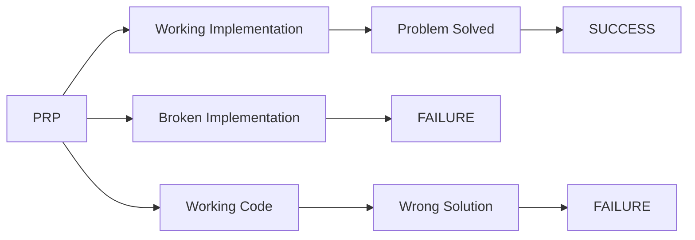

# prp-execution-blueprint

> **Note**: This blueprint defines the base execution process for ANY PRP (Procedural Reference Protocol). When executing tasks, the task-execution-blueprint adds additional task-specific management on top of this foundation.

## 🎯 CRITICAL SUCCESS OBJECTIVE

**Your mission is to execute the PRP instructions and SOLVE THE REAL PROBLEM.**

> ⚠️ **FAILURE CONDITION**: If your implementation doesn't work or doesn't solve the problem, you have FAILED regardless of following processes.



## 📋 EXECUTION FRAMEWORK

Execute these steps in sequence. Each step has validation checkpoints.

| Step | Focus | Success Criteria |
|------|-------|------------------|
| 1 | Pre-execution | Clean state, ready to execute |
| 2 | Context Understanding | Full comprehension of requirements |
| 3 | Implementation | Solution built following patterns |
| 4 | Testing & Validation | Everything works as specified |
| 5 | Failure Handling | Problems addressed decisively |
| 6 | Documentation & Cleanup | Work properly documented |

## 🔍 STEP-BY-STEP EXECUTION

### Step 1: Pre-execution Validation
**PURPOSE**: Ensure safe execution environment

**REQUIRED ACTIONS**:
- Check repository status (version control)
- If repository has uncommitted changes:
  - **ASK**: "Repository has uncommitted changes. This could cause conflicts during execution. Do you want to:
    1. Stop and commit/stash changes first (recommended)
    2. Continue anyway (at your own risk)
    3. View the changes before deciding"
  - Only proceed with explicit user confirmation if choosing option 2
- Confirm PRP file exists and is readable
- Validate execution environment is ready

**CHECKPOINT**: ✅ All validations pass OR user explicitly overrides OR ❌ STOP and report issues

### Step 2: Context Understanding
**PURPOSE**: Fully understand what needs to be built

**REQUIRED ACTIONS**:
- Read complete PRP file
- Extract ALL requirements and specifications
- Identify patterns to follow
- Understand acceptance criteria

**VALIDATION QUESTIONS** (Answer these explicitly):
- What EXACT problem does this PRP solve?
- What should the end result look like?
- What are the success criteria?
- What patterns/approaches should I follow?

**CHECKPOINT**: ✅ Complete understanding achieved OR ❌ STOP and ask for clarification

### Step 3: Implementation
**PURPOSE**: Build the solution that solves the problem

**IMPLEMENTATION STANDARDS**:
- Follow patterns specified in the PRP
- Create complete, working solution
- Ensure no breaking changes to existing functionality
- Write clean, readable, maintainable code

**CODE QUALITY CHECKLIST**:
- [ ] Code follows project conventions
- [ ] All requirements implemented
- [ ] Error handling included
- [ ] Performance considered
- [ ] Security best practices followed

### Step 4: Testing & Validation
**PURPOSE**: Verify implementation works correctly

**TESTING STRATEGY**:
```bash
# Run appropriate tests for your implementation
[run unit tests]
[run integration tests]
[run manual verification]
```

**VALIDATION PROCESS**:
1. **Functional Validation**: Does it work as specified?
2. **Regression Check**: Did anything break?
3. **Completeness Check**: Are all requirements met?
4. **User Experience**: Does this solve the intended problem?

**CHECKPOINT**: ✅ All tests pass and validation complete OR ❌ Fix issues before proceeding

### Step 5: Failure Handling
**PURPOSE**: Handle problems decisively and transparently

**FAILURE RESPONSE MATRIX**:

| Issue Type | Response Strategy |
|------------|------------------|
| Test failures | Fix immediately, don't proceed |
| Missing requirements | Ask for clarification |
| Technical blockers | Document and escalate |
| Partial implementation | Complete or revert |

**DECISION PROCESS**:
1. **Analyze**: What exactly failed and why?
2. **Decide**: Fix, revise, or ask for help?
3. **Act**: Execute decision with clear communication
4. **Document**: Record the issue and resolution

### Step 6: Documentation & Cleanup
**PURPOSE**: Record what was accomplished and clean up

**REQUIRED ACTIONS**:
- Document what was implemented
- Note any deviations from original plan
- Clean up temporary files or debug code
- Ensure code is ready for production

**DOCUMENTATION STANDARDS**:
- Clear description of changes made
- Any important decisions or trade-offs
- Instructions for testing or using the implementation

## 🚨 QUALITY GATES

You must pass these gates or STOP and address issues:

| Gate | Requirement | Action if Failed |
|------|-------------|------------------|
| **Pre-execution** | Clean environment | ASK user, then STOP if no override |
| **Understanding** | Full comprehension | STOP, ask questions |
| **Implementation** | Code works | STOP, fix immediately |
| **Testing** | All tests pass | STOP, don't proceed |
| **Validation** | Problem solved | STOP, complete implementation |

## 💡 DECISION-MAKING FRAMEWORK

When facing uncertainty, use this priority order:

1. **Problem Solution**: Does this solve the actual problem?
2. **PRP Requirements**: Does this meet specified criteria?
3. **Code Quality**: Is this maintainable and robust?
4. **Project Standards**: Does this follow established patterns?

## 🎯 SUCCESS DEFINITION

**You succeed when**:
- ✅ The implementation works as specified
- ✅ All tests pass consistently
- ✅ The solution solves the real problem
- ✅ Code quality meets standards
- ✅ Work is properly documented

**Remember**: Perfect process with broken code = FAILURE. Working code that solves the problem = SUCCESS.