# prp-generation-blueprint

## 🎯 CRITICAL SUCCESS OBJECTIVE

**Your mission is to read user requirements and upgrade the PRP system to enable successful task execution.**

> ⚠️ **FAILURE CONDITION**: If the generated task cannot be executed independently by execute-prp, you have FAILED regardless of following processes.


## 📋 EXECUTION FRAMEWORK

You must execute ALL 9 steps in sequence. Each step builds the foundation for independent task execution.

| Step | Purpose | Critical Output |
|------|---------|----------------|
| 1 | Input Processing | Validated requirements + system scan |
| 2 | System Loading | Complete current state understanding |
| 3 | Integration Analysis | Upgrade strategy + conflict resolution |
| 4 | Domain Upgrade | Updated knowledge maps + data architecture |
| 5 | Feature Evolution | Enhanced implementation specs |
| 6 | Context Engineering | Complete embedded knowledge with snapshots |
| 7 | Task Generation | Self-contained executable task |
| 8 | Relationship Update | Consistent document network |
| 9 | Quality Validation | System integrity verification |

> **Note**: This blueprint is used by the command located at `.claude/commands/PRPs/generate-prp.md`

## 🔍 STEP-BY-STEP EXECUTION

### Step 1: Input Processing and Validation
**PURPOSE**: Establish what needs to be built and validate system readiness

**REQUIRED ACTIONS**:
- Parse input specification (parameter or fallback to PROMPT.md)
- Validate content has sufficient detail for implementation
- Identify key requirements, features, and constraints
- Scan PRPs/ directory structure for current system state

**VALIDATION QUESTIONS** (Answer these explicitly):
- What EXACT problem does this specification solve?
- What are the concrete deliverables expected?
- What technical constraints or requirements are specified?
- What is the current state of the PRP system?

**CHECKPOINT**: ✅ Requirements are clear and implementable OR ❌ STOP and request clarification

### Step 2: System Context Loading
**PURPOSE**: Understand complete current system to plan integration

```mermaid
flowchart LR
    A[Domains/] --> B[Mapas de conhecimento]
    C[Features/] --> D[Zooms detalhados]
    E[System/] --> F[Templates & Standards]
    G[Tasks/] --> H[Ações executáveis]
    
    B --> I[Current System State]
    D --> I
    F --> I
    H --> I
```



**REQUIRED ACTIONS**:
- Load ALL existing domains (mapas de conhecimento) and extract knowledge patterns
- **Scan Examples/ directory for reference materials**:
  - UI/ folder for interface mockups and design patterns
  - Any other example folders for system design references
  - Note visual styles, layouts, and interaction patterns for reuse
- Read ALL current features (zooms detalhados) to understand implementation approaches
- Parse system templates (now in System/ directly), standards, and architectural decisions
- Review PRP-OVERVIEW.md for project-wide context and PRP-SYSTEM.md for framework understanding
- Map existing relationships and dependencies between documents
- **Identify existing Data Architecture domain if present**

**KNOWLEDGE EXTRACTION CHECKLIST**:
- [ ] Domain knowledge patterns documented
- [ ] Feature implementation approaches identified
- [ ] System templates and standards loaded (from System/ directory)
- [ ] PRP-OVERVIEW.md and PRP-SYSTEM.md reviewed
- [ ] Current architectural constraints understood
- [ ] Existing document relationships mapped
- [ ] Data Architecture domain status checked

### Step 3: Integration Analysis and Planning
**PURPOSE**: Determine how new requirements integrate with existing system

**INTEGRATION ANALYSIS MATRIX**:

| New Requirement | Existing System Element | Integration Type | Action Required |
|----------------|------------------------|------------------|-----------------|
| [Feature A] | [Domain X] | Extends | Update domain patterns |
| [Feature B] | [Feature Y] | Conflicts | Resolve compatibility |
| [Feature C] | None | Net New | Create new documentation |
| [Data Models] | Data Architecture.md | Extends/New | Update or create domain |

**REQUIRED ACTIONS**:
- Compare new requirements against ALL existing domains and features
- Identify overlaps, conflicts, and natural extension points
- Plan integration strategy: extend vs modify vs create new
- Determine which existing documents need updates for consistency
- **Identify if data models need centralized management**

**CRITICAL DECISIONS TO MAKE**:
- Which domains need knowledge pattern updates?
- Which features require modification vs net new creation?
- What architectural decisions impact multiple components?
- How to maintain backward compatibility?
- **Should data models be centralized in Data Architecture domain?**

**CHECKPOINT**: ✅ Integration plan maintains system consistency OR ❌ STOP and resolve conflicts

### Step 4: Domain Knowledge Upgrade
**PURPOSE**: Update knowledge maps (mapas de conhecimento) to support new implementation requirements

**DOMAIN UPDATE STRATEGY**:


**FOR EACH DOMAIN UPDATE**:
1. **Identify Knowledge Gaps**: What patterns/knowledge does the new requirement need?
2. **Extract Relevant Patterns**: What implementation guidance should be added?
3. **Maintain Consistency**: How does new knowledge integrate with existing patterns?
4. **Validate Completeness**: Does domain now support all related implementation needs?

**DATA ARCHITECTURE CONSIDERATIONS**:
- If data models are identified in requirements:
  - Create or update `Data Architecture.md` following domain-template.md structure
  - Use the "Data Architecture (When Applicable)" section from template
  - Define complete model schemas with all fields and relationships
  - Include validation rules and business logic
  - Establish as authoritative reference for all features

**DOMAIN UPDATE CHECKLIST**:
- [ ] New knowledge patterns added without duplicating existing content
- [ ] Domain maintains focus on specific knowledge area
- [ ] Patterns provide sufficient guidance for implementation
- [ ] Integration with existing domains remains logical
- [ ] Domain decomposition applied when complexity detected
- [ ] Data Architecture domain created/updated if models present

### Step 5: Feature Documentation Evolution
**PURPOSE**: Create or update detailed implementation specifications (zooms detalhados)

**FEATURE EVOLUTION DECISION TREE**:


**DATA MODEL HANDLING IN FEATURES**:
- Reference Data Architecture domain as source of truth
- Include only essential field snapshots for Context Engineering
- Add feature-specific extensions if needed
- Example:
  ```yaml
  # Source of Truth
  - **Data Architecture Domain**: [[Data Architecture.md]]
  
  # Context Engineering Snapshot
  User:
    essential_fields:
      - id: uuid
      - email: string
      - role: enum
  ```

**FEATURE QUALITY STANDARDS**:
- **Complete Vertical Increment**: Feature can be implemented independently
- **Clear User Value**: Specific problem solved for specific users
- **Technical Specificity**: Sufficient detail for implementation without guessing
- **Testable Acceptance Criteria**: Measurable success indicators
- **Model References**: Clear links to authoritative data definitions

**FEATURE VALIDATION CHECKLIST**:
- [ ] User flows cover success AND error scenarios
- [ ] Data model snapshots include essential fields only
- [ ] References to Data Architecture domain are clear
- [ ] API specifications define complete request/response contracts
- [ ] Technical implementation follows established patterns
- [ ] Acceptance criteria are specific and testable
- [ ] Feature integrates cleanly with existing system

### Step 6: Context Engineering Creation
**PURPOSE**: Compile complete knowledge needed for independent task execution

**CONTEXT ENGINEERING COMPOSITION**:

| Knowledge Type | Source | Purpose in Task |
|---------------|--------|-----------------|
| **Domain Patterns** | Updated domains | Implementation guidance |
| **Architectural Decisions** | System docs | Technical constraints |
| **Integration Requirements** | Feature specs | System connectivity |
| **Quality Standards** | Templates | Acceptance criteria |
| **Code Patterns** | Existing implementations | Consistency standards |
| **Data Model Snapshots** | Features referencing domains | Essential structure context |
| **Visual Examples** | Examples/UI/ mockups | Interface design patterns |
| **Reference Materials** | Examples/ subfolders | Implementation references |

**CONTEXT ENGINEERING ASSEMBLY PROCESS**:
1. **Extract Relevant Knowledge**: Pull only what's needed for this specific implementation
2. **Embed Patterns**: Include code examples, architectural patterns, quality standards
3. **Include Context**: Add enough background for understanding without external navigation
4. **Add Model Snapshots**: Include essential data structures from features
5. **Validate Completeness**: Ensure context enables independent execution
6. **Include Visual References**: Add links to relevant UI mockups and examples
7. **Embed Design Patterns**: Reference visual examples that match feature requirements

**DATA MODEL SNAPSHOT STRATEGY**:
- Extract from feature specifications, not full domain models
- Include only fields and relationships needed for the task
- Add reference to authoritative domain for complete definitions
- Ensure snapshot provides sufficient context for implementation

**CONTEXT ENGINEERING CHECKLIST**:
- [ ] All relevant domain knowledge embedded
- [ ] Architectural decisions and constraints included
- [ ] Integration patterns and requirements specified
- [ ] Quality standards and acceptance criteria defined
- [ ] Code patterns and examples provided
- [ ] Data model snapshots included where needed
- [ ] No external document dependencies required

### Step 7: Task Generation with Embedded Context
**PURPOSE**: Create self-contained executable task (ação executável) with complete embedded knowledge

**TASK STRUCTURE REQUIREMENTS**:


**EMBEDDED CONTEXT MUST INCLUDE**:
- **Domain Knowledge**: Relevant patterns from updated domains
- **Architectural Context**: Technical decisions and constraints
- **Integration Guidance**: How to connect with existing system
- **Quality Standards**: Code quality, testing, documentation requirements
- **Implementation Patterns**: Specific approaches to follow
- **Data Model Context**: Essential snapshots for data manipulation
- **Visual References**: Links to UI mockups from Examples/UI/ when applicable
- **Design Patterns**: Reference to visual examples that guide implementation

**TASK GENERATION CHECKLIST**:
- [ ] Task name follows convention: `Task XX - Description.md`
- [ ] Context section contains complete embedded knowledge
- [ ] Data model snapshots included if task involves data
- [ ] Implementation steps are specific and actionable
- [ ] Acceptance criteria are measurable and testable
- [ ] Quality standards are clearly defined
- [ ] Task can be executed without reading other documents
- [ ] Task will be executable by `.claude/commands/PRPs/execute-prp.md`

### Step 8: Relationship Network Update
**PURPOSE**: Maintain document consistency and navigability after changes

**RELATIONSHIP UPDATE PROCESS**:


**RELATIONSHIP TYPES TO UPDATE**:
- **Hierarchical**: `up` fields pointing to parent contexts
- **Lateral**: `related` fields connecting peer documents
- **Dependencies**: `dependencies` fields for prerequisites
- **Feature Links**: `feature` fields connecting tasks to features
- **Data References**: Links to Data Architecture domain

**RELATIONSHIP UPDATE CHECKLIST**:
- [ ] All modified documents have updated frontmatter
- [ ] Bidirectional relationships are consistent
- [ ] No broken or orphaned links exist
- [ ] New task properly links to updated feature
- [ ] Cross-references reflect document changes
- [ ] Data Architecture references are properly established

### Step 9: Quality Validation and Self-Check
**PURPOSE**: Verify system integrity and task executability

**SYSTEM QUALITY GATES**:

| Quality Gate | Validation Criteria | Action if Failed |
|--------------|-------------------|------------------|
| **System Consistency** | All documents maintain logical relationships | Fix inconsistencies |
| **Task Completeness** | Task can execute without external docs | Add missing context |
| **Knowledge Integration** | New patterns integrate with existing | Resolve conflicts |
| **Requirements Coverage** | All original requirements addressed | Complete missing elements |
| **Data Model Integrity** | Models centralized and referenced properly | Fix model organization |

**FINAL VALIDATION QUESTIONS**:
1. **Can execute-prp run this task successfully?**
   - Does task contain all necessary context?
   - Are implementation steps specific enough?
   - Are acceptance criteria testable?
   - Are data model snapshots sufficient?

2. **Does the system remain internally consistent?**
   - Do updated domains maintain logical structure?
   - Do features integrate cleanly with system?
   - Are all document relationships valid?
   - Is Data Architecture properly referenced?

3. **Are all requirements adequately addressed?**
   - Is every requirement mapped to implementation?
   - Are architectural decisions appropriate?
   - Are quality standards maintained?
   - Are data models properly managed?

**DECISION CHECKPOINT**: ✅ System ready for task execution OR ❌ Iterate improvements

## 🚨 CRITICAL QUALITY GATES

You must pass these gates or STOP and address issues:

| Gate | Requirement | Action if Failed |
|------|-------------|------------------|
| **Requirements Clarity** | Understand what to build | STOP, ask for clarification |
| **System Consistency** | Changes don't break existing patterns | STOP, resolve conflicts |
| **Task Completeness** | Task can execute independently | STOP, add missing context |
| **Integration Integrity** | New work fits existing system | STOP, fix integration issues |

## 💡 DECISION-MAKING FRAMEWORK

When facing uncertainty, use this priority order:

1. **Task Executability**: Will execute-prp be able to complete this successfully?
2. **System Consistency**: Does this maintain the integrity of existing documentation?
3. **Requirements Fulfillment**: Does this solve the user's actual problem?
4. **Quality Standards**: Does this meet established quality and architectural standards?

## 🎯 SUCCESS DEFINITION

**You succeed when**:
- ✅ System documentation is updated to support new requirements
- ✅ Generated task can be executed independently by execute-prp
- ✅ All system relationships remain consistent and navigable
- ✅ Original requirements are fully addressed in implementation-ready form
- ✅ Quality standards are maintained throughout the system
- ✅ Data models are properly centralized and referenced

**Remember**: The task you generate must enable execute-prp (located at `.claude/commands/PRPs/execute-prp.md`) to succeed without any additional context from the system documentation.